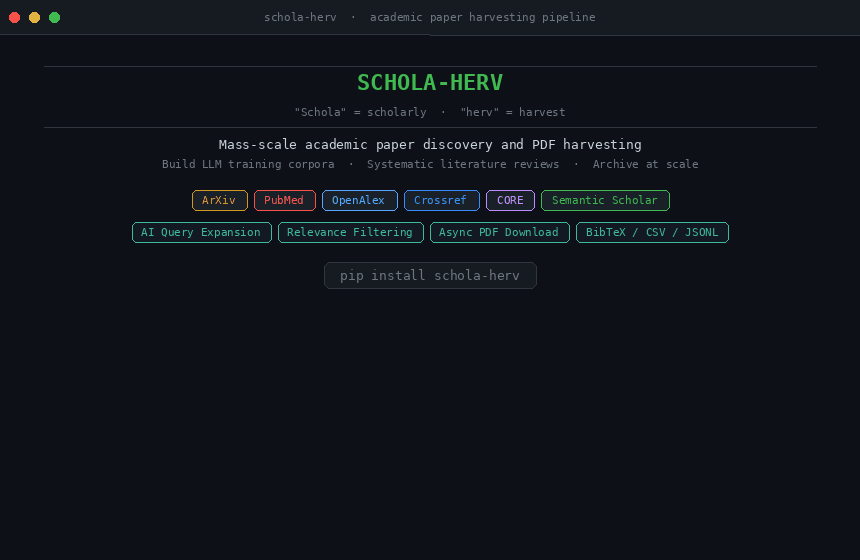

# Schola-herv

> **"Schola"** = scholarly · **"herv"** = harvest

**Schola-herv** is an open-source command-line tool for mass-scale academic paper discovery and PDF downloading. Built for researchers and engineers who need large, domain-specific corpora — for training language models, systematic literature reviews, or archiving scientific literature at scale.

[](https://www.python.org/)
[](LICENSE)
[](https://pypi.org/project/schola-herv/)
---

## Table of Contents

1. [How It Works](#how-it-works)
2. [Installation](#installation)
3. [Normal Mode — Standard Harvesting](#normal-mode--standard-harvesting)
   - [harvest](#harvest--bulk-pdf-download)
   - [survey](#survey--metadata--excel-spreadsheet)
   - [discover](#discover--metadata-only)
   - [run](#run--interactive-wizard)
   - [serve](#serve--web-dashboard)
4. [AI Mode — LLM-Powered Harvesting](#ai-mode--llm-powered-harvesting)
   - [Setup: Ollama](#step-1-install-ollama)
   - [Query Expansion](#query-expansion----ai-expand)
   - [Relevance Filtering](#relevance-filtering----ai-relevance-n)
   - [Paper Summarisation](#paper-summarisation----ai-summarise)
   - [Natural Language Interface](#natural-language-interface----ask)
   - [Combining AI Flags](#combining-all-ai-flags)
5. [Search Sources](#search-sources)
6. [Corpus Recipes](#corpus-recipes)
7. [Output Structure](#output-structure)
8. [Configuration](#configuration)
9. [Docker](#docker)
10. [Project Structure](#project-structure)
11. [Contributing](#contributing)
12. [License](#license)

---

## How It Works

Schola-herv runs a sequential pipeline from keyword to PDF:

```
Your keywords / DOIs / HTML page
         │
         ▼
  ┌─────────────────┐
  │   Discovery     │  Search ArXiv, PubMed, Crossref, OpenAlex, CORE, Semantic Scholar
  └────────┬────────┘
           │  paper metadata (title, DOI, authors, year, abstract)
           ▼
  ┌─────────────────┐
  │   Enrichment    │  Unpaywall resolves open-access PDF links per DOI
  └────────┬────────┘
           │
           ▼
  ┌─────────────────┐
  │   Filtering     │  year · citations · journal · skip-words · AI relevance score
  └────────┬────────┘
           │
           ▼
  ┌─────────────────┐
  │   Download      │  async · concurrent · resumable · exponential-backoff retry
  └────────┬────────┘
           ▼
    corpus_output/
    ├── *.pdf
    ├── metadata.jsonl
    ├── papers.csv
    ├── bibliography.bib
    └── report.md
```

---

## Installation

**Requirements:** Python 3.10+

### From PyPI

```bash
pip install schola-herv
```

### From Source

```bash
git clone https://github.com/yahiashawon/schola-herv.git
cd schola-herv
pip install -e .
```

### With Conda

```bash
conda env create -f environment.yml
conda activate schola_herv
pip install -e .
```

### Verify

```bash
schola-herv --version
# schola-herv 1.0.0
```

---

## Normal Mode — Standard Harvesting

Normal mode requires **no extra dependencies** beyond the base install. It searches academic APIs, resolves open-access PDF links, and downloads papers concurrently.

---

### `harvest` — Bulk PDF Download

The primary command. Searches one or more sources, resolves PDF links via Unpaywall, applies quality filters, and downloads.

```bash
schola-herv harvest -k KEYWORDS [OPTIONS]
```

**Minimal example:**

```bash
schola-herv harvest -k "deep learning" -m 500 -o ./corpus
```

**All options:**

| Option | Default | Description |
|--------|---------|-------------|
| `-k, --keywords` | — | Comma-separated search terms *(required unless `--doi-file`, `--cites`, or `--parse-html` is used)* |
| `-m, --max` | `10000` | Maximum papers to download |
| `-o, --output` | `./corpus_output` | Output directory |
| `--concurrent` | `10` | Simultaneous download connections |
| `--sources` | `both` | `arxiv` · `pubmed` · `crossref` · `openalex` · `core` · `both` · `all` |
| `--year-from` | — | Earliest publication year |
| `--year-to` | — | Latest publication year |
| `--min-citations` | — | Keep only papers with ≥ N citations |
| `--max-dwn-cites` | — | Keep only the top N most-cited papers |
| `--max-dwn-year` | — | Keep only the N most recent papers by year |
| `--journal-filter` | — | CSV file of journal names or ISSNs |
| `--journal-mode` | `block` | `block` (exclude listed journals) · `allow` (include only listed) |
| `--skip-words` | — | Comma-separated words — skip papers whose title/abstract contains them |
| `--doi-file` | — | Text or CSV file of DOIs to download directly (bypasses search) |
| `--parse-html` | — | Parse DOIs from an HTML file or URL |
| `--cites` | — | Download all papers citing this DOI (via Semantic Scholar) |
| `--recipe` | — | Load a pre-built YAML recipe (see [Corpus Recipes](#corpus-recipes)) |
| `--log-file` | — | Write full logs to a file |
| `--ai-expand` | off | *(AI mode)* Expand keywords with LLM |
| `--ai-relevance` | — | *(AI mode)* Keep only papers scoring ≥ N (1–5) |
| `--ai-summarise` | off | *(AI mode)* Generate one-sentence LLM summary per paper |

**Examples:**

```bash
# ArXiv only, 2015–2024, up to 5000 papers
schola-herv harvest \
  -k "particle physics,LHC,Standard Model" \
  --sources arxiv \
  --year-from 2015 --year-to 2024 \
  -m 5000 -o ./particle_corpus

# All sources, keep only top 500 most-cited papers
schola-herv harvest \
  -k "transformer,BERT,language model" \
  --sources all \
  --min-citations 50 --max-dwn-cites 500 \
  -o ./top_nlp_papers

# Download from a DOI list file
schola-herv harvest --doi-file my_dois.txt -o ./doi_downloads

# Download all papers citing a landmark paper
schola-herv harvest --cites "10.1038/nature14539" -o ./citing_papers

# Exclude preprints and reviews
schola-herv harvest \
  -k "genomics,CRISPR" \
  --skip-words "preprint,review,survey" \
  -o ./genomics_corpus

# Save logs to file
schola-herv harvest -k "quantum computing" -m 1000 \
  -o ./qc_corpus --log-file harvest.log
```

---

### `survey` — Metadata + Excel Spreadsheet

Discovers papers and produces a structured **Excel spreadsheet** with full metadata: title, authors, year, DOI, abstract, journal, citation count, and — optionally — SCImago journal quartile and impact factor. PDFs are downloaded alongside unless `--metadata-only` is specified.

```bash
schola-herv survey -k KEYWORDS --excel-output FILE [OPTIONS]
```

| Option | Default | Description |
|--------|---------|-------------|
| `-k, --keywords` | — | Comma-separated keywords *(required)* |
| `--excel-output` | — | Output path for the `.xlsx` file *(required)* |
| `--sources` | `all` | Sources to search |
| `--max` | `100` | Maximum papers to discover |
| `--year-from / --year-to` | — | Year range filter |
| `--metadata-only` | off | Generate Excel only — skip PDF download |
| `--pdf-folder` | `./survey_pdfs` | Where to save downloaded PDFs |
| `--scimago-csv` | — | SCImago Journal Rank CSV for journal quartile enrichment |
| `--ai-expand` | off | *(AI mode)* Expand keywords |
| `--ai-relevance` | — | *(AI mode)* Filter by LLM relevance score |
| `--ai-summarise` | off | *(AI mode)* Add AI summary column to Excel |

**Examples:**

```bash
# Metadata only — no PDFs
schola-herv survey \
  -k "quantum computing,qubit" \
  --max 300 \
  --excel-output quantum_survey.xlsx \
  --metadata-only

# Full survey with PDFs and journal rankings
schola-herv survey \
  -k "high energy physics" \
  --max 500 \
  --excel-output hep_survey.xlsx \
  --pdf-folder ./hep_pdfs \
  --scimago-csv data/hep_scimago.xlsx \
  --year-from 2018
```

---

### `discover` — Metadata Only

Lightweight search that saves paper metadata as JSON without downloading any PDFs.

```bash
schola-herv discover \
  --topic "machine learning,neural networks" \
  --source arxiv,crossref \
  --max 200 \
  --output ./metadata_only
```

Metadata is saved to `./metadata_only/metadata.json`.

---

### `run` — Interactive Wizard

A step-by-step guided wizard — suitable for first-time use or exploratory runs. Prompts for: topics, sources, year range, max papers, output directory, quality filters, and optional AI features. Saves the resulting job configuration to a YAML file for later reuse.

```bash
schola-herv run
```

---

## AI Mode — LLM-Powered Harvesting

AI mode adds three optional enhancements to the standard pipeline, powered by a **locally running LLM** via [Ollama](https://ollama.com). No data is sent to external AI services — all inference runs on your own machine.

```
Normal mode:  keywords  ──►  search  ──►  download
              ─────────────────────────────────────
AI mode:      keywords  ──►  [expand]  ──►  search
                         ──►  [score & filter]
                         ──►  download
                         ──►  [summarise]
```

The three AI flags can be used individually or combined:

| Flag | When it runs | What it does |
|------|-------------|--------------|
| `--ai-expand` | Before search | LLM expands your keywords into ~20 diverse queries |
| `--ai-relevance N` | After search, before download | LLM scores each paper 1–5; keeps only those scoring ≥ N |
| `--ai-summarise` | After download | LLM writes a one-sentence summary per paper |

---

### Step 1: Install Ollama

```bash
# Linux / macOS
curl -fsSL https://ollama.com/install.sh | sh

# Pull the default model (llama3.2)
ollama pull llama3.2

# Ollama is auto-started by Schola-herv when any AI flag is used.
# To start it manually:
ollama serve
```

> **Custom endpoint:** If Ollama runs on a remote host:
> ```bash
> export OLLAMA_URL="http://my-server:11434/api/generate"
> ```

---

### Query Expansion — `--ai-expand`

The LLM takes your input keywords and generates up to **20 diverse search queries**, broadening discovery across different terminology, sub-fields, and phrasing variations.

**Without `--ai-expand`:** searches only the exact keywords provided.  
**With `--ai-expand`:** searches exact keywords **plus** up to 20 LLM-generated variants.

```bash
schola-herv harvest \
  -k "gravitational waves" \
  --sources arxiv \
  --ai-expand \
  -m 2000 -o ./gw_corpus
```

Given `"gravitational waves"`, the LLM might generate queries such as:
- `"LIGO interferometer binary merger"`
- `"GW150914 compact binary coalescence"`
- `"gravitational wave strain measurement"`
- `"black hole neutron star inspiral signal"`
- … and 16 more

> **When to use:** Topics with many synonyms, abbreviations, or evolving terminology. Less useful for very broad terms (e.g. `"physics"`) where breadth is not the bottleneck.

---

### Relevance Filtering — `--ai-relevance N`

The LLM reads the **title and abstract** of each discovered paper and assigns a relevance score from **1 to 5** relative to your topic. Papers scoring below `N` are discarded *before download*, saving time and bandwidth.

| Score | Meaning |
|-------|---------|
| 1 | Not relevant |
| 2 | Tangentially related |
| 3 | Somewhat relevant |
| 4 | Clearly on-topic |
| 5 | Exactly on-topic |

```bash
# Keep only papers scoring 4 or higher
schola-herv harvest \
  -k "transformer architecture,attention mechanism" \
  --sources all \
  --ai-relevance 4 \
  -m 3000 -o ./transformer_corpus
```

> **Recommended threshold:** `4` for most use cases. Use `3` for higher recall, `5` for maximum precision.  
> **Note:** Filtering runs before download — irrelevant papers never consume bandwidth.

---

### Paper Summarisation — `--ai-summarise`

After each PDF is downloaded, the LLM generates a **one-sentence plain-English summary** of the paper's main contribution. Summaries are:

- Stored as `"ai_summary"` in `metadata.jsonl`
- Added as an **"AI Summary" column** in the Excel output when used with `survey`

```bash
schola-herv harvest \
  -k "quantum error correction" \
  --sources arxiv \
  --ai-summarise \
  -m 500 -o ./qec_corpus
```

Example output:
> *"Proposes a surface-code decoder using reinforcement learning that reduces logical error rates by 40% compared to minimum-weight perfect matching."*

> **When to use:** Building literature review datasets, or when you need a quick digest of each paper without reading abstracts manually.

---

### Natural Language Interface — `ask`

Describe what you want in plain English. The LLM translates it into the correct `harvest` command.

```bash
# Preview the translated command (does not run anything)
schola-herv ask "download 1000 papers on CRISPR gene editing from 2019 onwards"

# Translate and execute immediately
schola-herv ask "get the top 500 most cited deep learning papers, skip reviews" --execute
```

Example translation:

```
Input:   "1000 neutrino oscillation papers from arxiv, 2010 to 2020, highly cited only"

Output:  schola-herv harvest \
           --keywords "neutrino oscillation" \
           --sources arxiv \
           --max 1000 \
           --year-from 2010 \
           --year-to 2020 \
           --min-citations 10
```

> **Tip:** Always review the translated command before adding `--execute`, especially for large or destructive jobs.

---

### Combining All AI Flags

All three flags can be stacked for maximum corpus quality:

```bash
schola-herv harvest \
  -k "ATLAS detector,CMS experiment,particle collision" \
  --sources arxiv \
  --year-from 2010 \
  -m 10000 \
  --ai-expand \
  --ai-relevance 4 \
  --ai-summarise \
  -o ./hep_ai_corpus \
  --log-file harvest.log
```

End-to-end pipeline with all AI flags enabled:

```
Input keywords
      │
      ▼  --ai-expand
  ~20 LLM-generated query variants
      │
      ▼  search all sources
  Raw paper list (title + abstract available)
      │
      ▼  --ai-relevance 4
  Filtered list — only papers scored ≥ 4 by LLM
      │
      ▼  download PDFs
      │
      ▼  --ai-summarise
  Final corpus with ai_summary field in metadata.jsonl
```

The built-in HEP recipe enables all AI flags automatically:

```bash
schola-herv harvest --recipe hep -o ./hep_corpus
```

---

## Search Sources

All sources are free and require no API key unless noted.

| Source | `--sources` value | Coverage | Notes |
|--------|------------------|----------|-------|
| **ArXiv** | `arxiv` | Physics, CS, Math, Biology preprints | Best for HEP, ML, CS |
| **PubMed** | `pubmed` | Biomedical and life sciences | NCBI Entrez — real email required |
| **Crossref** | `crossref` | DOI registry, all disciplines | No PDF links; Unpaywall resolves them |
| **OpenAlex** | `openalex` | 250M+ works across all fields | Largest OA index; email recommended |
| **CORE** | `core` | Open-access full texts from repositories | Provides direct PDF links |
| **Semantic Scholar** | *(enrichment)* | Citation counts, citation graph | Used with `--cites` for citation-based discovery |
| **Unpaywall** | *(enrichment)* | OA PDF link lookup by DOI | Requires email in `config.yaml` |

**`--sources` shorthand values:**

| Value | Sources queried |
|-------|----------------|
| `arxiv` | ArXiv only |
| `pubmed` | PubMed only |
| `crossref` | Crossref only |
| `openalex` | OpenAlex only |
| `core` | CORE only |
| `both` | ArXiv + Crossref *(default)* |
| `all` | ArXiv + Crossref + OpenAlex + CORE |

---

## Corpus Recipes

Recipes are pre-built YAML configurations in `schola_herv/recipes/` that reproduce a complete corpus with one flag.

**Built-in recipes:**

| Recipe | Domain | Max papers | Sources | AI |
|--------|--------|-----------|---------|-----|
| `hep` | High Energy Physics | 50,000 | ArXiv | expand + relevance 4 + summarise |
| `hep_small` | HEP quick test | 50 | ArXiv | expand + relevance 4 + summarise |

```bash
# Use a recipe
schola-herv harvest --recipe hep -o ./hep_corpus

# Override recipe values with CLI flags
schola-herv harvest --recipe hep --year-from 2020 -m 5000 -o ./hep_recent
```

**Creating a custom recipe** — save as `schola_herv/recipes/my_topic.yaml`:

```yaml
keywords:
  - "your primary keyword"
  - "related term"
sources: "all"
max_results: 5000
year_from: 2015
year_to: 2024
min_citations: 5
skip_words:
  - "review"
  - "survey"
ai_expand: false
ai_relevance: 3
ai_summarise: false
```

```bash
schola-herv harvest --recipe my_topic -o ./my_corpus
```

---

## Output Structure

```
corpus_output/
├── *.pdf               — Downloaded PDF files (one per paper)
├── metadata.jsonl      — Structured metadata, one JSON object per line
├── papers.csv          — Flat CSV for spreadsheet tools
├── bibliography.bib    — BibTeX entries for all papers
├── report.md           — Summary report (counts, sources, top papers by citations)
└── checkpoint.json     — Resume state — do not delete mid-run
```

Each record in `metadata.jsonl`:

```json
{
  "title": "Observation of Gravitational Waves from a Binary Black Hole Merger",
  "authors": ["Abbott, B.P.", "Abbott, R."],
  "year": 2016,
  "doi": "10.1103/PhysRevLett.116.061102",
  "source": "arxiv",
  "pdf_url": "https://arxiv.org/pdf/1602.03837",
  "abstract": "On September 14, 2015...",
  "citation_count": 15200,
  "journal": "Physical Review Letters",
  "ai_summary": "Reports the first direct detection of gravitational waves from merging black holes."
}
```

---

## Configuration

Schola-herv reads `config.yaml` from the current working directory.

```yaml
user_agent: "Schola-herv/2.0 (mailto:your.email@example.com)"

rate_limits:
  arxiv: 3.0       # seconds between requests
  pubmed: 0.5
  crossref: 0.5
  unpaywall: 1.0
  default: 2.0

download:
  max_concurrent: 10   # simultaneous downloads
  retry_attempts: 3    # retries per failed paper
  timeout: 60          # per-request timeout in seconds

unpaywall:
  email: "your.email@example.com"  # required by Unpaywall ToS
```

**Environment variables** (override `config.yaml`):

| Variable | Description |
|----------|-------------|
| `SCHOLAHERV_EMAIL` | Contact email for Unpaywall, OpenAlex, CORE polite-pool access |
| `SCHOLAHERV_UNPAYWALL_EMAIL` | Override email for Unpaywall specifically |
| `SCHOLAHERV_USE_SCIHUB` | Set `true` to enable Sci-Hub fallback *(see legal notice below)* |
| `OLLAMA_URL` | Ollama API base URL (default: `http://localhost:11434/api/generate`) |

---

## Docker

```bash
# Build
docker build -t schola-herv .

# Run a harvest (output saved to ./corpus on the host)
docker run --rm \
  -v $(pwd)/corpus:/app/corpus_output \
  schola-herv harvest \
  -k "deep learning,neural networks" \
  -m 1000 \
  -o /app/corpus_output

# With AI features (Ollama must be running on the host)
docker run --rm \
  -e OLLAMA_URL=http://host.docker.internal:11434/api/generate \
  -v $(pwd)/corpus:/app/corpus_output \
  schola-herv harvest \
  -k "deep learning" \
  --ai-expand --ai-relevance 4 \
  -o /app/corpus_output
```

---

## Project Structure

```
schola_herv/
├── cli.py                     — All CLI subcommands (harvest, survey, ask, serve, …)
├── harvester.py               — Core async pipeline orchestrator
├── jobs.py                    — Job definition and YAML persistence
├── interview.py               — Interactive wizard (run command)
├── metadata_builder.py        — Excel/metadata builder and DOI resolver
├── config.py                  — Config file loader
│
├── discovery/                 — Search backends
│   ├── arxiv.py               — ArXiv API
│   ├── pubmed.py              — NCBI PubMed / Entrez
│   ├── crossref.py            — Crossref REST API
│   ├── openalex.py            — OpenAlex REST API
│   ├── semantic_scholar.py    — Semantic Scholar (keyword search + citation graph)
│   ├── unpaywall.py           — Unpaywall OA link enrichment
│   └── core.py                — CORE open-access repository
│
├── downloader/                — PDF download engine
│   ├── manager.py             — Async orchestrator (shared session, retry)
│   ├── checkpoint.py          — Resume state (O(1) set-based lookup, atomic save)
│   └── sources/
│       ├── arxiv.py           — ArXiv PDF downloader
│       ├── direct.py          — Generic URL downloader
│       ├── pmc.py             — PubMed Central OA downloader
│       └── scihub.py          — Sci-Hub fallback (opt-in via env var)
│
├── ai/                        — AI features (all via Ollama)
│   ├── ollama_manager.py      — Auto-start/stop local Ollama process
│   ├── query_expander.py      — Expand keywords into ~20 diverse queries
│   ├── relevance_filter.py    — Score papers 1–5 and filter below threshold
│   ├── summariser.py          — One-sentence paper summaries
│   └── natural_language.py    — Plain-English → harvest command translation
│
├── quality/                   — Post-discovery filters
│   ├── journal_filter.py      — Block/allow journals by name or ISSN
│   └── semantic_scholar.py    — Citation count enrichment via S2 batch API
│
├── extraction/                — Post-download text extraction
│   └── pdf.py                 — extract_text() and batch_extract() via PyMuPDF
│
├── recipes/                   — Pre-built YAML corpus configurations
│   ├── hep.yaml               — High Energy Physics (50K papers)
│   └── hep_small.yaml         — HEP quick test (50 papers)
│
└── utils/
    ├── network.py             — Shared aiohttp session factory and fetch helpers
    ├── dedup.py               — Paper deduplication (DOI + title hash)
    ├── logger.py              — Rich console logger with optional file output
    └── pdf_utils.py           — PDF magic-byte verification and filename generator

webapp/                        — Coming
```

---

## Contributing

Contributions are welcome. Please read [CONTRIBUTING.md](CONTRIBUTING.md) before opening a pull request.

```bash
# Development setup
git clone https://github.com/yahiashawon/schola-herv.git
cd schola-herv
pip install -e .
pip install -r requirements-dev.txt

# Run tests
pytest tests/ -v

# Lint
ruff check schola_herv/
```

---

## Legal Notice

Schola-herv downloads only **open-access** PDFs by default (ArXiv, Unpaywall, PMC, CORE).

The optional Sci-Hub fallback (`SCHOLAHERV_USE_SCIHUB=true`) may be **unlawful** in some jurisdictions. Users are solely responsible for compliance with applicable laws and the terms of service of any API accessed.

---

## License

[MIT](LICENSE) © 2025 MD Yahia Shawon — Institute of High Energy Physics (IHEP), Chinese Academy of Sciences
